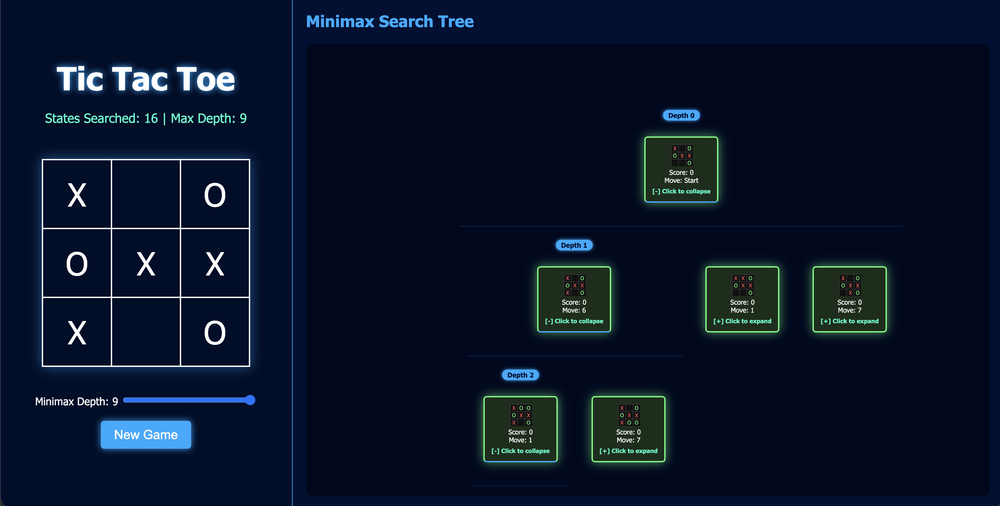
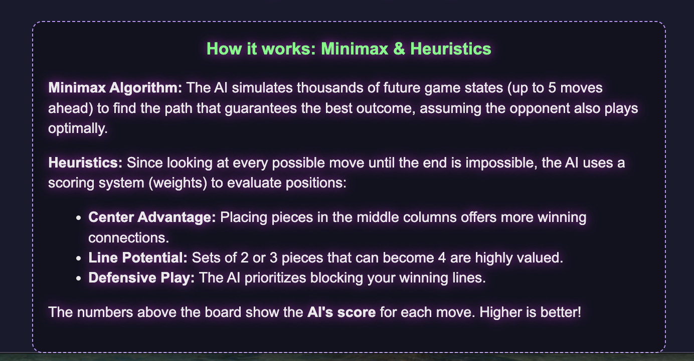
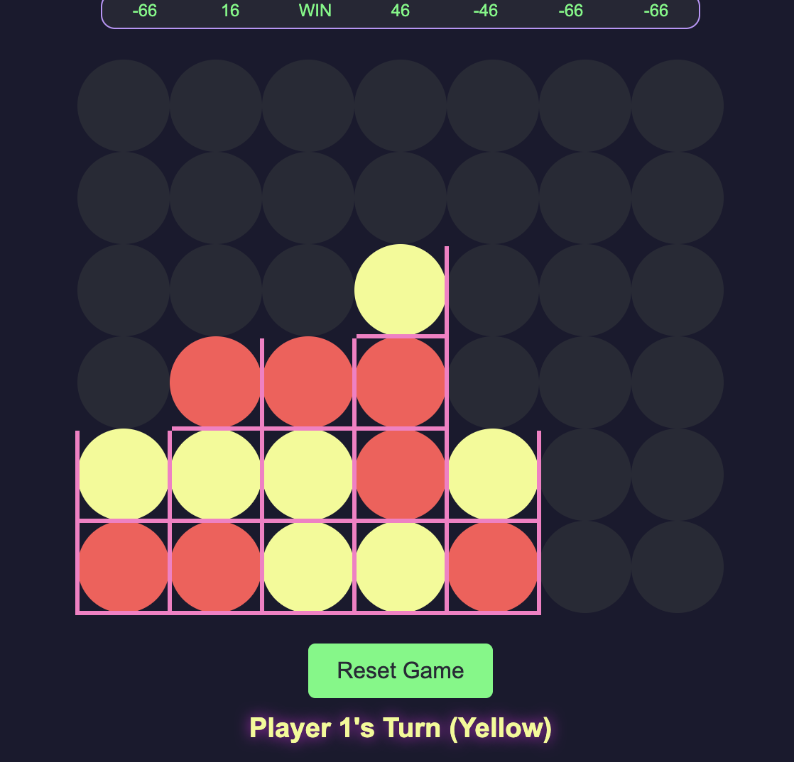

# Minimax AI Applications

An educational playground featuring classic games powered by the **Minimax Algorithm** with **Alpha-Beta Pruning**. This project focuses on visualizing the AI's decision-making process, making complex game theory concepts accessible and interactive.

---

## 🎮 Games & Visualizations

### 1. Tic-Tac-Toe: Dynamic Search Tree
Experience a deep dive into the AI's "brain." For every move, the AI generates a searchable, interactive tree of potential future states.

**Key Features:**
- **Real-time Tree Generation:** See every board state the AI evaluates.
- **Interactive Exploration:** Expand and collapse branches to follow specific lines of play.
- **Best Path Highlighting:** The AI's chosen "Principal Variation" (the best sequence of moves) is highlighted in neon green.
- **Smart Auto-Collapse:** Automatically collapses irrelevant branches to keep the visualization clean.
- **Depth Control:** Adjust the search depth (up to 9) to see how it affects the number of states searched.



---

### 2. Connect 4: Heuristic Weights & Strategy
Connect 4 uses a more complex evaluation function (heuristics) since searching to the end of the game is computationally expensive.

**Key Features:**
- **Weight Visualization:** A dedicated row above the board displays the AI's "score" for each possible move in real-time.
- **Advanced Heuristics:** The AI evaluates positions based on center column control, line potential (sets of 2 or 3), and immediate threats.
- **Educational UI:** Integrated explanations of how the scoring system works and how the AI prioritizes defensive vs. offensive play.
- **Thinking Indicator:** Visual feedback when the AI is calculating its next move.




---

## 🧠 Technical Overview

### The Minimax Algorithm
Minimax is a recursive decision-making algorithm used in two-player games. It aims to find the optimal move for a player, assuming that the opponent is also playing optimally.
- **Maximizer:** Tries to get the highest score possible.
- **Minimizer:** Tries to get the lowest score possible for the maximizer.

### Alpha-Beta Pruning
An optimization technique for Minimax that eliminates branches that cannot possibly influence the final decision. This significantly reduces the number of nodes evaluated, allowing the AI to search deeper into the game tree in less time.

### Heuristic Evaluation (Connect 4)
In Connect 4, the game tree is too large to search to the terminal nodes (win/loss/tie) within a reasonable time. Instead, the AI uses a **Heuristic Function** to estimate the "value" of a board state at a specific depth (e.g., Depth 5).
- **Positive Scores:** Favor the AI (Red).
- **Negative Scores:** Favor the Human (Yellow).
- **Terminal States:** "WIN" or "LOSE" are assigned near-infinite values.

---

## 🚀 How to Run

1. **Clone the repository:**
   ```bash
   git clone https://github.com/yourusername/min-max-algo-aplications.git
   ```
2. **Open the games:**
   - Navigate to the project folder.
   - For Tic-Tac-Toe: Open `TicTacToe/tictactoe.html` in any modern web browser.
   - For Connect 4: Open `connect4/connect4.html` in any modern web browser.

No dependencies or local servers are required—just standard HTML, CSS, and ES6 Modules.

